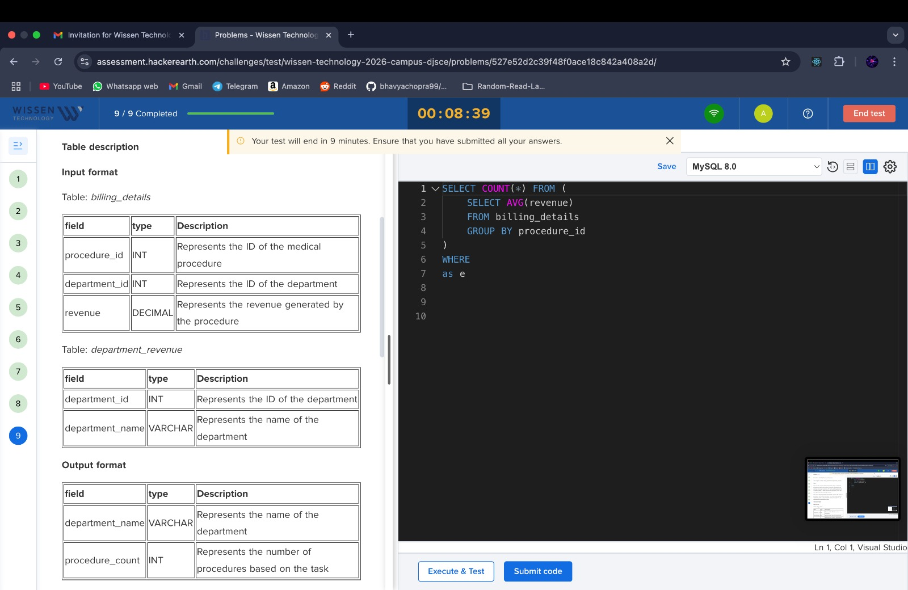
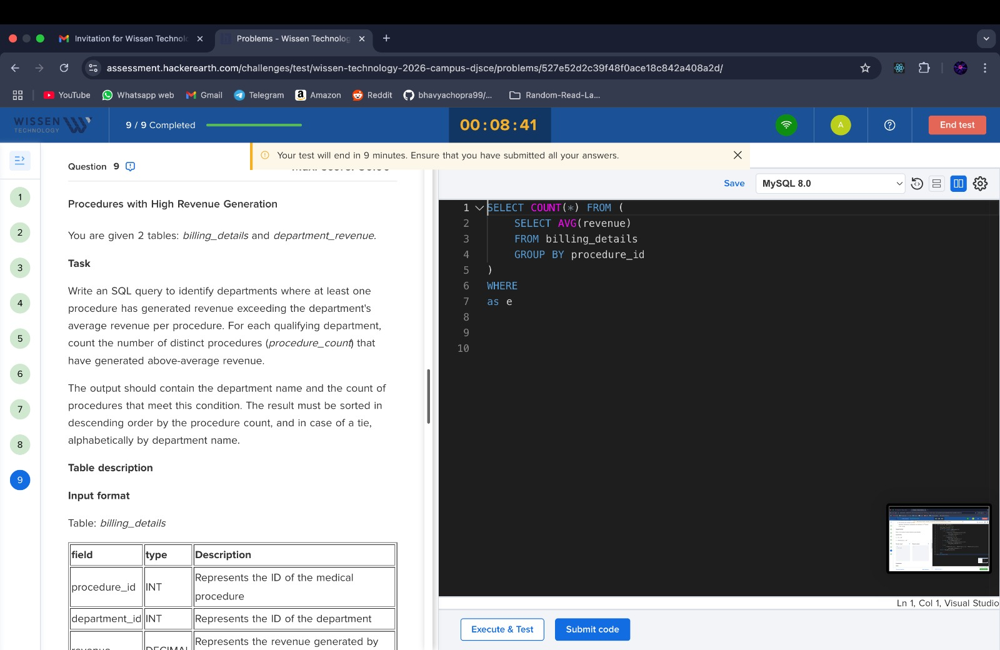
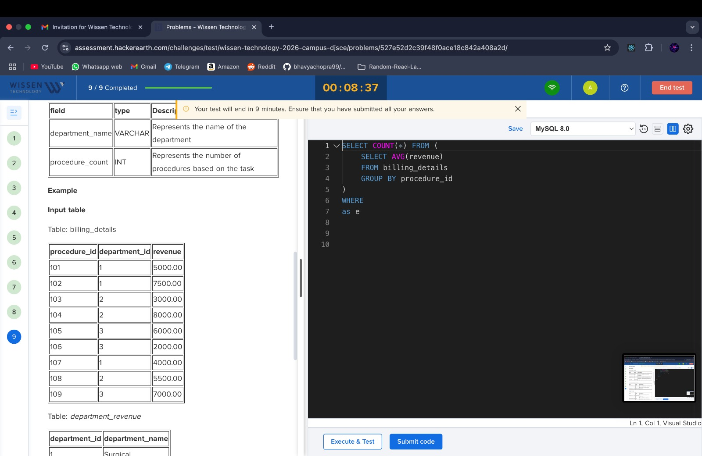
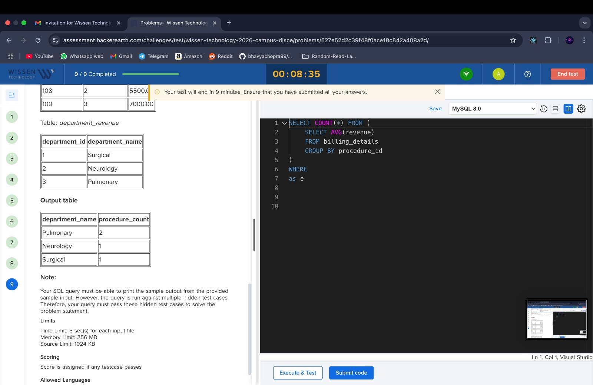

### **Round 1: Online Assessment (Hacker Earth)**

#### **Section 1: Multiple Choice Questions (MCQs)**

**Topics Covered:**

- **Technical:**
    - Data Structures
    - DBMS
    - Operating Systems (Segmentation, Paging)
- **Aptitude:**
    - Calendars
    - Arithmetic reasoning
    - Blood relations

#### **Section 2: Coding Questions**

1. **Easy-Level Problem: Virus Affects Two RAM Memories**
    https://leetcode.com/problems/incremental-memory-leak/
    https://algo.monster/liteproblems/1860
    - Two RAMs are affected by a virus that reduces memory by 1 unit per second.
    - The larger memory is reduced first. If both are equal, reduce the first one.
    - **Objective:** Find the time when any of the two memories becomes 0.
        
2. **Medium-Level Problem: LRU Cache**
    
    - Implement a **Least Recently Used (LRU)** cache.
    - Core concepts: Linked list, hashmaps, cache eviction policy.
        
3. **Resource Allocation Problem: Students and Computers**
    
    - Each student can use computers to the **left or right**.
    - Each computer supports **up to 2 students**.
    - **Objective:** Calculate the **minimum number of computers** required.
        
4. **SQL Query (Easy to Medium)**
    
    - Involving:
        
        - **Joins**
        - **ORDER BY** (ascending)
        - **GROUP BY** clause
    
## ✅ **Round 2: Technical Interview (Detailed Answers)**

---

### **1. Self-Introduction**

**Answer Format:**

> “Hello, I’m [Your Name], currently in my final year pursuing B.E. in Computer Engineering. I’ve done internships where I worked with technologies like React, Django, and Android. I’ve also contributed to projects involving web scraping and full-stack development. I’m particularly strong in Data Structures and Algorithms and enjoy solving problems on platforms like LeetCode. My final year project is focused on [brief 1-liner about your project idea]. I’m enthusiastic about scalable systems and optimizing solutions for real-world problems.”

**Tip:** Be confident and tailor this to your resume. Always connect your experience with what the company does.

---

### **2. DSA Question 1: Array of Words → Lengths → Nested Odd/Even Arrays**

#### 🧠 **Problem Statement:**

Given an array of words:

- Find the **length** of each word.
- Classify into **odd** and **even** based on length.
- If more than 3 words, group them into a **nested array**.

#### ✅ **Example:**

Input: `["apple", "bat", "cat", "mango"]`  
Lengths: `[5, 3, 3, 5]`  
Odd → `[5, 3, 3, 5]`  
Even → `[]`  
Output: `[[[odd, odd, odd, odd]]]` (nested because > 3)

#### ✅ **Pseudocode:**

```
#include <iostream>
#include <vector>
using namespace std;

int main() {
    string words[] = {"apple", "bat", "cat", "mango"};
    int n = sizeof(words) / sizeof(words[0]);

    vector<int> odd, even;

    // Step 1: Classify word lengths into odd/even
    for (int i = 0; i < n; i++) {
        int len = words[i].length();
        if (len % 2 == 0) even.push_back(len);
        else odd.push_back(len);
    }

    // Step 2: Prepare result
    vector<vector<int>> result;

    if (n > 3) {
        vector<int> combined;
        for (int i = 0; i < odd.size(); i++) combined.push_back(odd[i]);
        for (int i = 0; i < even.size(); i++) combined.push_back(even[i]);
        result.push_back(combined);
    } else {
        if (!odd.empty()) result.push_back(odd);
        if (!even.empty()) result.push_back(even);
    }

    // Step 3: Print result
    for (int i = 0; i < result.size(); i++) {
        for (int j = 0; j < result[i].size(); j++) {
            cout << result[i][j] << " ";
        }
        cout << endl;
    }

    return 0;
}
```

```
#include <iostream>
#include <sstream>
#include <vector>
using namespace std;

int main() {
    string input = "apple bat cat mango";
    stringstream ss(input);
    string word;

    vector<int> odd, even;
    vector<string> words;

    // Step 1: Extract words using stringstream
    while (ss >> word) {
        words.push_back(word);
        int len = word.length();
        if (len % 2 == 0) even.push_back(len);
        else odd.push_back(len);
    }

    // Step 2: Prepare result
    vector<vector<int>> result;
    int n = words.size();

    if (n > 3) {
        vector<int> combined;
        for (int i = 0; i < odd.size(); i++) combined.push_back(odd[i]);
        for (int i = 0; i < even.size(); i++) combined.push_back(even[i]);
        result.push_back(combined);
    } else {
        if (!odd.empty()) result.push_back(odd);
        if (!even.empty()) result.push_back(even);
    }

    // Step 3: Print result
    for (int i = 0; i < result.size(); i++) {
        for (int j = 0; j < result[i].size(); j++) {
            cout << result[i][j] << " ";
        }
        cout << endl;
    }

    return 0;
}
```

#### ✅ **Follow-up Topics to Cover:**

- Time complexity: **O(n)** (single pass through list)
- Space complexity: **O(n)** (separate lists for odd/even)
- Can suggest optimization using list comprehension for brevity

---

### **3. DSA Question 2: Count Letter Occurrences in Sentence**

#### 🧠 **Problem Statement:**

Given a sentence, count how many times each letter appears. Optimize your approach.

#### ✅ **Approach: Using HashMap**

- Iterate through the string. 
- For each **alphabet character**, update the frequency in a hashmap.
#### ✅ **Code :**

```
#include <iostream>
#include <map>
#include <cctype>
using namespace std;

int main() {
    string sentence = "The Quick Brown Fox Jumps Over The Lazy Dog!";
    map<char, int> freq;

    for (int i = 0; i < sentence.length(); i++) {
        char ch = sentence[i];
        if (isalpha(ch)) {
            ch = tolower(ch); // Convert to lowercase
            freq[ch]++;
        }
    }

    for (char ch = 'a'; ch <= 'z'; ch++) {
        if (freq[ch] > 0) {
            cout << ch << " → " << freq[ch] << endl;
        }
    }

    return 0;
}
```

#### ✅ **HashMap Explanation:**

- A **hashmap** (or unordered_map in C++) provides:
    
    - Average-case: **O(1)** time for insertion & lookup
    - Worst-case: **O(n)** if collisions occur (rare)

#### ✅ **Why HashMap > Array here?**

- Array of size 26 can work (if you assume only lowercase letters), but:
    
    - HashMap is more **generalized** (case-insensitive, unicode)
    - More readable for **key-value** logic
        

#### ✅ **Trade-offs:**

|Data Structure|Time|Space|Notes|
|---|---|---|---|
|Array[26]|O(n)|O(1)|Only for English lowercase|
|HashMap|O(n)|O(k)|Works for any characters|

---

### **4. SQL Questions**

#### **A. Types of Joins:**

- **INNER JOIN:** Only matching records    
- **LEFT JOIN:** All from left, matching from right
- **RIGHT JOIN:** All from right, matching from left
- **FULL OUTER JOIN:** All records, match if possible
    
#### **B. Ordering Results:**

`SELECT * FROM students ORDER BY name ASC; SELECT * FROM students ORDER BY marks DESC;`

#### **C. Grouping Data:**

`SELECT department, COUNT(*)  FROM employees  GROUP BY department;`

#### **D. SQL vs NoSQL:**

|SQL|NoSQL|
|---|---|
|Structured data|Unstructured/semi-structured|
|Fixed schema|Dynamic schema|
|ACID transactions|High scalability|
|Relational joins|Denormalized documents|

#### ✅ **When to Use:**

- Use **SQL** for: banking systems, ER models, consistent data
    
- Use **NoSQL** for: real-time analytics, social media feeds, flexible schema
    

---

### **5. Final Year Project Discussion**

Prepare this beforehand! Here's a structure:

#### ✅ **Template Answer:**

> “My final year project is titled _[Project Name]_. The idea is to develop a solution that _[problem it solves]_. I plan to use _[technology stack]_ such as [e.g., Python, Flask, MongoDB]. The core functionalities include [e.g., face detection, real-time alerts]. The goal is to make it scalable, modular, and optimized for performance. I’m also using Git and Agile methods for proper version control and iterative development.”

Be ready to:

- Draw a **system architecture**
    
- Explain **data flow**
    
- Highlight **challenges** faced and how you solved them
    

---

### ✅ **Quick Tips for Round 2:**

- Speak clearly, and write clean pseudocode (don’t rush to syntax).
- When discussing DSA, always mention **time/space complexity**.
- Know your **internship**, **projects**, and **SQL basics** inside out.
- Prepare 1–2 **counter-questions** to ask at the end (e.g., “How do you structure DSA training for freshers?”)
    

---
## ✅ **Round 3: Managerial + Executive Director Round (Detailed Answers & Concepts)**

---

### **1. Self-Introduction & Resume-Based Discussion**

#### ✅ **Sample Introduction (Customized for ED-level Round):**

> "Hello, I’m [Your Name], currently in my final year of Computer Engineering. Over the past year, I’ve worked on a wide range of technologies including Android development, Django, React, and web scraping during my internships and personal projects. My interest lies in building scalable systems and exploring real-world applications of software design. I’m particularly proud of my final year project where I am building a system to [state goal], using [tech stack]. I believe my strengths lie in fast learning, system design, and problem-solving."

**Tip:** Focus more on **impact and challenges**, not just tools.

### **2. Widget Interaction Scenario – Metadata Syncing**

#### 🧠 **Scenario:**

A user interacts with a widget repeatedly. Each interaction generates **metadata** that must be sent to a **database**. How do you:

- Manage the communication efficiently?
- Decide when and how often to sync?
    
#### ✅ **Answer:**

> “Every widget interaction would generate lightweight metadata (e.g., user ID, timestamp, action type). Instead of sending a DB request on **every interaction**, I’d use a **local queue or buffer** that batches metadata. Using **debouncing** or **time-based triggers**, I would sync data in intervals (e.g., every 5 seconds or every 10 events), using an **asynchronous background job**. This reduces the number of DB hits and improves performance.”

#### ✅ **Core Concepts:**

- **Debouncing:** Waits for inactivity before performing the action (reduces frequency).
- **Throttling:** Ensures syncs happen no more than once in a set time.
- **Queue/Buffering:** Temporarily stores data before batching.
- **Asynchronous Communication:** Data sent in background without blocking UI.
- **Sync Strategies:**
    - **Real-time:** High accuracy, more resource usage.
    - **Batching:** Better performance, slightly delayed data.
        
### **3. Web Scraping NSE/BSE – Missing Document Scenario**

#### 🧠 **Scenario:**

You're scraping daily reports from NSE/BSE. On Day 4, the document `"b"` is missing. How do you detect this and handle it?

#### ✅ **Answer:**

> “I would maintain a **date-indexed data structure** like a dictionary or hashmap with keys as dates and values as filenames. If ‘b’ is missing for a specific date, the script would either log the failure or retry with an **exponential backoff strategy**. I’d use **error handling** (e.g., `try-except`) and maintain a **failure log** or notification system for manual intervention if retries fail. To detect missing files, I could compare the scraped list against a pre-defined template or expected pattern.”

#### ✅ **Core Concepts:**

- **HashMap:** Key-value store for fast lookup of file presence.
- **Exponential Backoff:** Retry with increasing delay on repeated failure.
- **Error Logging:** Keeping logs for failures to review or alert.
- **Data Integrity Checks:** Compare actual vs expected files.

### **4. Website Indexing Scenario – Large URL Set**

#### 🧠 **Scenario:**

You need to generate an **index document** for a website containing many URLs.

#### ✅ **Answer:**

> “I’d parse the HTML structure using tools like **BeautifulSoup** or **Sitemap XML** if available. I’d store the URL list in a structured document (like JSON or XML) with metadata such as last modified date, page depth, etc. For efficiency, I’d create a **tree structure** or **graph-based map** if internal links matter. The index would be paginated or segmented for scalability.”

---

#### ✅ **Core Concepts:**

- **Sitemap/Indexing:** A structured file listing pages (Google uses this).
- **Depth-First/ Breadth-First Parsing:** Helps in determining structure depth.
- **Tree/Graph Representation:** For internal links and crawl order.
- **JSON/XML Output:** Structured, readable, and API-ready.

### **5. C/C++ Compiler Questions**

#### 🧠 **Questions:**

- **How are header files resolved?**
- **What does `#define int float` do?**
- **Why prefer C++ over Java?**
#### ✅ **Answers:**

1. **Header File Resolution:**
    
    > The preprocessor replaces `#include` with the actual file content before compilation. Standard headers are searched in system paths; custom headers in project directories. Compilation fails if the header isn’t found.
    
2. **`#define int float`:**
    
    > This preprocessor directive replaces every occurrence of `int` with `float` **before compilation**. So, `int a = 5;` becomes `float a = 5;`. It's dangerous and leads to unpredictable behavior, used mostly for obscure experiments.
    
3. **C++ vs Java:**

| C++                              | Java                               |
| -------------------------------- | ---------------------------------- |
| Faster, low-level memory control | Platform-independent               |
| Manual memory management         | Garbage collection                 |
| Pointers, references             | No pointer manipulation            |
| Suitable for systems programming | Better for web/backend development |

### **6. ReactJS & JavaScript – Synchronous vs Asynchronous**

#### ✅ **Explanation:**

- **Synchronous Code:** Executes line-by-line; blocks further execution.
    
`let result = compute(); console.log(result);`

- **Asynchronous Code:** Doesn't wait; uses callbacks/promises to continue later.
    
`fetch(url).then(res => res.json()).then(data => console.log(data));`

- **Use Cases:**
    
    - API calls
    - Timers (`setTimeout`)
    - Event listeners
    - File reading (Node.js)---

#### ✅ **ReactJS Angle:**

- **React state updates** are async and batched.
- **useEffect()** is used for side-effects (e.g., fetching API data).
- Best practice: use **async/await** for readability in effects.
    
### **7. Internship Deep Dive**

#### ✅ **Expected Talking Points:**

- **Tech Stack:** What tools you used (React, Django, Android, etc.)
- **Responsibilities:** Specific tasks you completed
- **Client Interaction:**
    > “I worked closely with clients, gathering requirements through calls and translating those into flowcharts and functional wireframes before implementation.”
- **Problem Solving:**
    > “Once, we faced a challenge with dynamic form rendering. I solved it using component-based React forms with stateful logic.”
- **Startup Learning:**
    > “Wore multiple hats – testing, development, deployment. Learned prioritization and lean architecture.”
    
### **8. HR + Feedback + Candidate Questions**

#### ✅ **Possible HR Questions:**

- “Tell me about a challenge you faced during a project.”
- “What motivates you to work in tech?”
- “Are you open to relocation?”
- “Where do you see yourself in 5 years?”

#### ✅ **Smart Questions to Ask Them:**

- “What does a typical tech stack look like for your projects?”
- “How do new hires get mentored or onboarded?”
- “What’s the career growth path at Wissen for engineers?”
    
### ✅ **Final Tips for Round 3:**

- Be **confident but humble**; they’re testing your composure and mindset.
- Be ready to **back every line on your resume** with details.
- When you don’t know something, **explain how you’d figure it out.**
- Emphasize **teamwork, initiative**, and your **learning attitude**.

# WISSEN OA (DJSCE 2026)

### 1. Problem: **Server Capability**

You have to manage a server that serves the requests of its clients who have subscribed to its paid service. You are given **N** clients who have taken the subscription.

- For each client `i`, you are given:
    
    - `L[i]`: the **start time** (in seconds) when the client starts sending requests.
    - `R[i]`: the **end time** (in seconds) when the client stops sending requests.
    - `A[i]`: the **number of requests per second** made by the client.
        
The server should have a minimum **serving capacity `X`** (requests per second) such that it can **handle all client requests** at any point in time.

> A server with capacity `X` **cannot serve more than X requests/second**.
### 🎯 Objective

Find the **minimum value of `X`** such that the server is able to serve all requests at all times.
### 🧾 Input

- `N`: Integer, number of clients.
- `A`: Array of size `N`, `A[i]` is the number of requests/sec by client `i`.
- `L`: Array of size `N`, start time of requests for client `i`.
- `R`: Array of size `N`, end time of requests for client `i`.
### 🧪 Sample Input

1  // test case
4 (N)
4 3 2 2 (A)
3 4 1 4 (L)
6 5 7 5` (R)
### ✅ Sample Output

`11`

📌 Explanation:

- At **time = 4**, the server receives max load: 4 (client 0) + 3 (client 1) + 2 (client 3) + 2 (client 2) = **11**

![[serverdsa.jpg]]

![[server3dsa.jpg]]

![[server2dsa.jpg]]
### 🧪 Input:
N = 4 
A = [4, 3, 2, 2] 
L = [3, 4, 1, 4] 
R = [6, 5, 7, 5]`

Each client sends `A[i]` requests per second from time `L[i]` to `R[i]`.
### ✅ Full Function:

```
int findMaxRequests(int n, vector<int>& a, vector<int>& l, vector<int>& r) {
    map<int, int> timeline;

    for (int i = 0; i < n; ++i) {
        timeline[l[i]] += a[i];        // add requests at start time
        timeline[r[i] + 1] -= a[i];    // remove after end time
    }

    int maxLoad = 0, currLoad = 0;
    for (auto& t : timeline) {
        currLoad += t.second;
        maxLoad = max(maxLoad, currLoad);
    }

    return maxLoad;
}
```

---

## 🧠 Step-by-Step Dry Run

### Step 1: Build `timeline` map

Each client adds to the map like this:

|i|L[i]|R[i]|A[i]|timeline changes|
|---|---|---|---|---|
|0|3|6|4|+4 at 3, -4 at 7|
|1|4|5|3|+3 at 4, -3 at 6|
|2|1|7|2|+2 at 1, -2 at 8|
|3|4|5|2|+2 at 4, -2 at 6|

Merged `timeline` map becomes:

`timeline = {     
1: +2,    
3: +4,     
4: +5,   // (3 + 2)     
6: -5,   // (-3 -2)     
7: -4,     
8: -2 }`

### Step 2: Sweep timeline

`currLoad = 0 maxLoad = 0`

Now loop over timeline (sorted by key):

|time|change|currLoad|maxLoad|
|---|---|---|---|
|1|+2|2|2|
|3|+4|6|6|
|4|+5|11|11 ✅ max|
|6|-5|6|11|
|7|-4|2|11|
|8|-2|0|11|

### 🎯 Final Answer:
`return maxLoad → 11`

## ✅ So What Happened?

At **time = 4**, all 4 clients were active:

- Client 0 (4)
- Client 1 (3)
- Client 2 (2)
- Client 3 (2)

→ Total = **11 requests/sec**

That’s the peak load — server needs at least **capacity X = 11** to handle this.

Brute force
```
#include <bits/stdc++.h>
using namespace std;

int findMaxRequestsBrute(int n, vector<int>& a, vector<int>& l, vector<int>& r) {
    int low = *min_element(l.begin(), l.end());
    int high = *max_element(r.begin(), r.end());

    int maxLoad = 0;

    for (int t = low; t <= high; ++t) {
        int currLoad = 0;
        for (int i = 0; i < n; ++i) {
            if (l[i] <= t && t <= r[i]) {
                currLoad += a[i];
            }
        }
        maxLoad = max(maxLoad, currLoad);
    }

    return maxLoad;
}
```

## ✅ Problem Statement: Slice Master

![[slicemasterdsa.jpg|300]]

You are given a string `S`. You must divide this string into one or more **non-empty substrings**, such that:

1. **Each character appears in at most one substring.**
2. For each substring of length `X`, you gain **X² points**.
3. Your goal is to **minimize the total points**.

Return the **minimum possible points** you can score after slicing the string `S`.

### 🧾 Input
- A string `S` of length up to `10^5`, containing only lowercase English letters.
### 📤 Output

- An integer representing the **minimum total score** achievable by slicing string `S` such that:
    - Each character appears in **only one part**, and
    - The sum of **(length of part)²** is **minimized**.
### 🧪 Sample Input

`abac`
### ✅ Sample Output

### 🔍 Explanation

We slice `"abac"` as: `"aba"` and `"c"`
- `"aba"` → valid (all characters till last 'a'), length = 3 → score = 3² = 9
- `"c"` → length = 1 → score = 1² = 1
- Total = 9 + 1 = 10 ❌ Not valid because 'a' appears in both

✅ Correct slicing: `"ab"` + `"ac"`
- `"ab"` → length = 2 → 4 points
- `"ac"` → length = 2 → 4 points
- Total = 8 ✅

But `"aba"`, `"c"` is better than `"ab"`, `"ac"` in this case? No. Wait—We must make sure that _no character repeats_. Correct slicing is: `"aba"` + `"c" is invalid since 'a' repeats.

Best is: `"ab"`, `"a"`, `"c"`
- lengths: 2 + 1 + 1 → score = 4 + 1 + 1 = **6**


## ✅ Problem Statement: Good Citizen

![[good citizen.jpg|300]]

You are appointed as the head of civil authority in your locality.
You are given:
- An integer `N`, the number of citizens.
- An array `Behaviour[]` of size `N`, where `Behaviour[i]` represents the behavior score of the `i-th` citizen.
    
A citizen is called a **"good citizen"** if:

`Behaviour[i] > (Behaviour[i-1] + Behaviour[i+1]) / 2`

- If `i-1` or `i+1` does not exist (i.e., for the first and last citizen), treat the missing neighbor's behavior as `0`.
### 🎯 Your task:
Count how many good citizens are present in the locality.
### 🧾 Input Format

- `N`: An integer (1 ≤ N ≤ 10^5) — number of citizens.    
- `Behaviour[]`: Array of `N` positive integers (1 ≤ Behaviour[i] ≤ 10^6)
### 📤 Output Format
- A single integer: number of good citizens.
### 🧪 Sample Input
5 
4 8 2 6 1`
### ✅ Sample Output
`2`
### 🔍 Explanation:
We check each citizen:

- `i = 0`: `4 > (0 + 8)/2` → `4 > 4` ❌
- `i = 1`: `8 > (4 + 2)/2 = 3` ✅
- `i = 2`: `2 > (8 + 6)/2 = 7` ❌
- `i = 3`: `6 > (2 + 1)/2 = 1.5` ✅
- `i = 4`: `1 > (6 + 0)/2 = 3` ❌

Good citizens = 2

```
#include <iostream>
#include <vector>
using namespace std;

int countGoodCitizens(int n, vector<int>& behaviour) {
    int count = 0;

    for (int i = 0; i < n; i++) {
        int left = (i - 1 >= 0) ? behaviour[i - 1] : 0;
        int right = (i + 1 < n) ? behaviour[i + 1] : 0; 
        int avg = (left + right) / 2;

        if (behaviour[i] > avg) {
            count++;
        }
    }
    return count;
}

int main() {
    int n;
    cin >> n;

    vector<int> behaviour(n);
    for (int i = 0; i < n; ++i) {
        cin >> behaviour[i];
    }

    int result = countGoodCitizens(n, behaviour);
    cout << result << endl;

    return 0;
}
```

# SQL





### Full Problem Statement (Rewritten Clearly)

**Title:** Procedures with High Revenue Generation

**🧾 You are given two tables:**
- `billing_details`
- `department_revenue`
### 📋 **Objective:**

Write an SQL query to **identify departments** where **at least one procedure** has generated **revenue greater than the department's average revenue per procedure**.

For each qualifying department, output:

- the **name of the department**
- the **count of distinct procedures** where the revenue is above the department's average revenue (called `procedure_count`)
### 📤 **Expected Output:**

- `department_name`: name of the department
- `procedure_count`: number of such high-revenue procedures in that department
### 📌 **Conditions:**

1. The query should **compare each procedure's revenue** with the **average revenue** of its department.
2. **Only include departments** that have **at least one procedure** with revenue **above the department's average**.
3. Sort the final result by:
    - `procedure_count` in **descending** order
    - If there's a tie, by `department_name` in **alphabetical** order.
### 🗂️ **Table Definitions:**

#### Table: `billing_details`

|Field|Type|Description|
|---|---|---|
|procedure_id|INT|ID of the medical procedure|
|department_id|INT|ID of the department|
|revenue|DECIMAL|Revenue generated by the procedure|

#### Table: `department_revenue`

|Field|Type|Description|
|---|---|---|
|department_id|INT|ID of the department|
|department_name|VARCHAR|Name of the department|

### 📥 **Example Input:**

#### `billing_details`

|procedure_id|department_id|revenue|
|---|---|---|
|101|1|5000.00|
|102|1|7500.00|
|103|2|3000.00|
|104|2|8000.00|
|105|3|6000.00|
|106|3|2000.00|
|107|3|7000.00|
|108|2|5500.00|
|109|3|7000.00|

#### `department_revenue`

|department_id|department_name|
|---|---|
|1|Surgical|
|2|Neurology|
|3|Pulmonary|

### 📤 **Expected Output:**

|department_name|procedure_count|
|---|---|
|Pulmonary|2|
|Neurology|1|
|Surgical|1|

### ✅ **Final SQL Solution:**

```
SELECT 
    dr.department_name,
    COUNT(DISTINCT bd.procedure_id) AS procedure_count
FROM 
    billing_details bd
JOIN 
    (
        SELECT 
            department_id,
            AVG(revenue) AS avg_dept_revenue
        FROM 
            billing_details
        GROUP BY 
            department_id
    ) dept_avg
    ON bd.department_id = dept_avg.department_id
JOIN 
    department_revenue dr
    ON bd.department_id = dr.department_id
WHERE 
    bd.revenue > dept_avg.avg_dept_revenue
GROUP BY 
    dr.department_name
ORDER BY 
    procedure_count DESC,
    dr.department_name ASC;
```
### 🔍 **Explanation of SQL Steps:**

1. **Subquery (`dept_avg`)**: Calculates the average revenue per department.
2. **Join with `billing_details`**: So we can compare each procedure's revenue with the department's average.
3. **Filter**: Only keep those rows where `bd.revenue > avg_dept_revenue`.
4. **Join with `department_revenue`**: To get the actual department name.
5. **Group by `department_name`**: Count distinct procedures satisfying the condition.
6. **Order results**: As per the requirement — by `procedure_count DESC`, then `department_name ASC`.

# Interview Question
### 🧠 **Problem: Century Intervals**
#### **Description**:

You are given an array `runs` of integers representing the scores of a batsman in consecutive cricket matches. Some elements in the array may be equal to a special value `x`, which represents that the batsman did **not play** that match.

Your task is to find the **number of matches played** between **two consecutive centuries**. A century is defined as a score of **100 or more runs** in a single match. You must only count matches where the batsman **played** (i.e., scores that are **not equal to `x`**) and **did not score a century**.

Do not modify the original `runs` array.
#### **Input**:

- An integer array `runs` of length `n` (`1 ≤ n ≤ 10^5`), where each element is an integer (`0 ≤ runs[i] ≤ 1000`).
- An integer `x` representing a value in `runs` that indicates a **match not played**.
#### **Output**:

- Return a list of integers, where each element represents the number of **played, non-century** matches between two consecutive centuries.
#### **Example 1**:

Input: runs = [120, 0, 80, 0, 150, 20, 0, 130] 
x = 0  
Output: [1, 1]  
Explanation: - 
Century 1 at index 0 → 120 
Century 2 at index 4 → 150 → one match played between (80) 
Century 3 at index 7 → 130 → one match played between (20)``
#### **Example 2**:
Input: runs = [0, 0, 100, 0, 0, 100, 0] x = 0  
Output: [0]  
Explanation: - Two centuries at index 2 and 5 - No matches played between them`
#### **Constraints**:

- Do not modify the input array.
- You must only count matches where the batsman played (i.e., `runs[i] != x`) and **did not** score a century.
- If there are less than two centuries, return an empty list.

